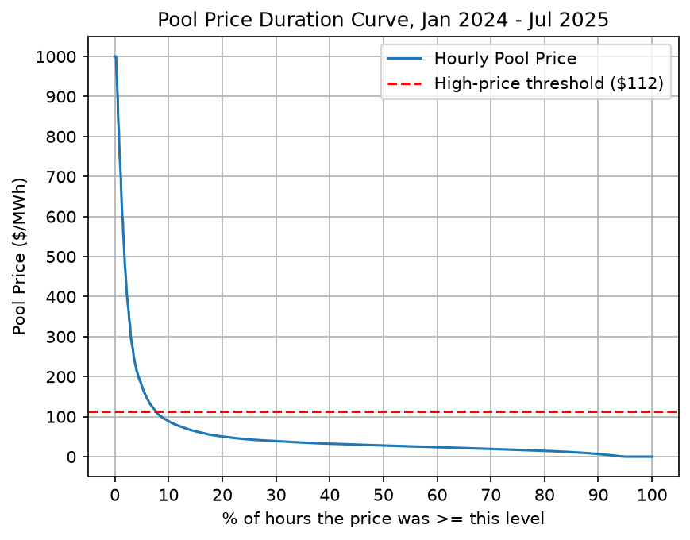
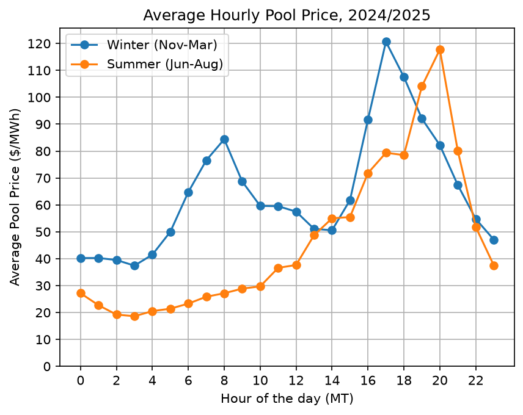
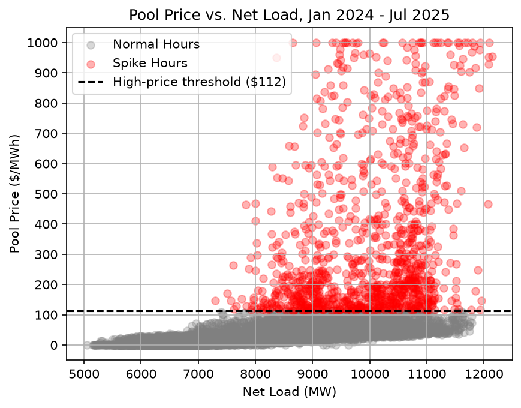
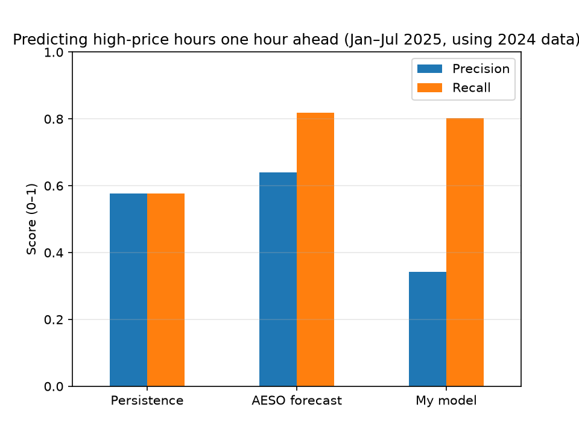

# What drives high Alberta pool prices, and can public data flag them one hour ahead?

I'm an electrical engineering student at the University of Alberta with experience in power systems, and I've recently become interested in electricity markets and trading.

I built this as my first Python data project to better understand what drives Alberta pool prices and to get some hands-on experience working with real market data. I used Claude as a tutor while I worked through the Python and modelling.

## Data

- AESO: Hourly Metered Volumes, Pool Price, and Alberta Internal Load, 2020 – Jul 2025
  https://www.aeso.ca/market/market-and-system-reporting/data-requests/hourly-generation-metered-volumes-and-pool-price-and-ail-data-2001-to-july-2025/
- Analysis period: Jan 2024 – Jul 2025
- Hourly data in Mountain Time
- Generators were mapped to fuel type using AESO's Current Supply & Demand page, linked in the code

## What I did

1. Cleaned the AESO data into one hourly dataset containing pool price, AIL, generation by fuel type, and imports/exports
2. Defined a high-price hour as any hour above $112/MWh, which was the 90th percentile of 2024 prices
3. Compared market conditions during high-price hours against normal hours
4. Built a simple logistic regression model using 2024 data and tested it on Jan–Jul 2025
5. Made sure the model only used information that would have been available one hour earlier
6. Compared the model against two simple benchmarks:
   - persistence: if the previous hour was high-price, predict the next hour will be high-price
   - AESO's own hour-ahead price forecast

## What I found

1. Price risk is concentrated in a relatively small number of hours.

About 8% of the hours in the dataset cleared above $112/MWh, while the median pool price was around $30/MWh.

2. Lower wind output appeared to matter more than higher demand during high-price hours.

Net load was about 1845 MW, or 23%, higher during high-price hours. Around 60% of that difference came from lower wind generation, while roughly 30% came from higher demand.

3. High net load seems to create the necessary conditions for price spikes, but is not a sufficient condition.

Price spikes were very uncommon below roughly 7500 MW of net load. However, there were still many hours above that level where prices remained low.

4. The model caught most high-price hours, but produced a lot of false alarms.

On the 2025 test data, the model caught about 80% of high-price hours, compared with 58% for the persistence benchmark. However, only 34% of the model's high-price alerts were actually correct.

5. AESO's hour-ahead forecast performed better than my model.

AESO's forecast had an F1 score of 0.72 compared with 0.48 for my model. One likely reason is that AESO has access to information such as generator offers and system conditions that are not fully available in the public real-time data I used.

## What I learned

This project taught me a lot more than just how to build a model.

I learned how important it is to avoid lookahead when working with time-snesitive data, since a forecasting model should only use information that would actually have been available at the time.

I also learned how to deal with daylight saving time (won't matter soon) in hourly electricity data by indexing the data in UTC and converting it back to local time when needed.

Overall, I gained skills in importing and cleaning data, and turning it into useful outputs that can support trading/operating activity within a generation owner's team

## Limitations

- The model does not include weather forecasts, nat gas prices, outage data, or generator offer data
- Fuel types were mapped using AESO's current generator list, so 10 retired units representing about 1.7% of total generation were left unmapped
- The 2025 test period only covers Jan–Jul
- AESO notes that Apr–Jul 2025 generation volumes are not yet finalized
- There were far fewer high-price hours in 2025 than in 2024, which made the test period more difficult

## Next steps

If I keep building on this project, the next things I would look at are:

- adding weather forecast data
- adding generator outage data
- adding natural gas prices
- testing whether transmission constraints improve the model
- tuning the alert threshold to trade off precision and recall
- retesting on a full year of newer data once it becomes available